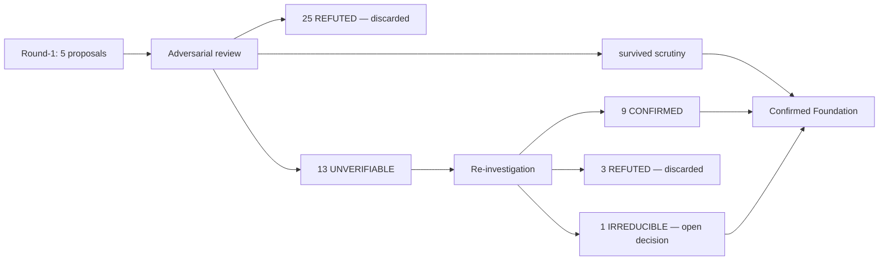

# Nine-Plane Adaptation — Confirmed Foundation Spec

> The buildable base for adapting the Nine-Plane Collaborative Framework onto oh-my-pi.
> Distilled from two review rounds; keeps only what survived scrutiny or was re-confirmed,
> strips every refuted overreach, and names every real gap that must be built net-new.

## What this document is

Round 1 produced 5 research proposals mapping the nine planes onto oh-my-pi. Two review
rounds then stress-tested every claim against `/tmp/oh-my-pi` source:

1. **Adversarial review** (`docs/research/rebuttals/`) — 5 fresh reviewers hunted for
   infeasibility counterexamples. Discarded 25 refuted claims; surfaced 13 `? UNVERIFIABLE`.
2. **Re-investigation** (`docs/research/resolutions/`) — 5 fresh resolvers drove those 13 to
   terminal verdicts by reading function bodies, call sites, and schemas: **9 CONFIRMED,
   3 REFUTED, 1 IRREDUCIBLE**.

This foundation spec collapses all of that into a single buildable inventory. Every entry
is graded and cited to `/tmp/oh-my-pi` `file:line`. Nothing here is aspirational — a
capability is listed as **confirmed buildable** only if it survived adversarial review or
was re-confirmed; everything refuted is quarantined under *discarded overreach* so it is
never re-proposed.

## The funnel



## Cross-plane gate status

| Plane cluster | ✅ Confirmed buildable | ❌ Gaps (net-new) | 🗑 Discarded | ⚠ Open decision | Section |
|---|---|---|---|---|---|
| Governance | 11 | 7 | 5 | 1 | [01](01-governance.md) |
| Orchestration + Search | 13 | 8 | 5 | 0 | [02](02-orchestration-search.md) |
| Evaluation | 7 | 4 | 4 | 0 | [03](03-evaluation.md) |
| Reality + Learning | 9 | 6 | 6 | 0 | [04](04-reality-learning.md) |
| Spec + Decision + Delivery | 9 | 6 | 8 | 0 | [05](05-spec-decision-delivery.md) |
| **Total** | **49** | **31** | **28** | **1** | — |

`49 confirmed` = survived-adversarial + re-confirmed across all clusters (13
re-confirmations of the 9 UNVERIFIABLE-CONFIRMED plus survived-scrutiny items folded in per
cluster). `28 discarded` = adversarial refutations + the 3 re-investigation REFUTED items.

## The one pattern that governs everything

Across all five clusters the reviews converged on a single shape:

> **oh-my-pi's *substrate* is richer than round-1 credited — but every *policy/automation
> layer* the proposals wanted on top of it is genuinely absent and must be built net-new.**

- The substrate delivers, concretely: `tool_call` pre-execution blocking, structured
  per-candidate diffs (`pi-iso diff()`), retained per-voice recall scores, belief
  update/dampen actions (SHMR), mid-session `TtsrManager.addRule()`, session-tree
  `id/parentId` linkage, durable session-file JSONL, metaharness head-to-head comparison.
- The missing layers are consistent: no core task DAG / cost-aware scheduler, no
  query-driven context assembly, no statistical significance / regression alerting, no
  metamorphic or adversarial test generation, no acceptance-criteria formalism, no ADR
  persistence, no cross-session audit aggregation, no failure taxonomy.

Design consequence: **build the policy layers *on* the confirmed primitives; do not
re-litigate whether the primitives exist.** The 28 discarded items are closed — they assumed
mechanisms that either don't exist (`ContextUsage.totalTokens`, `tools.whitelist`,
`delivery_signal` event, `ctx.advise`) or work opposite to the claim (TTSR aborts streams
but does not block tools; checkpoint/rewind does NOT restore the filesystem; `yield` is
subagent-only).

## Nature-of-build legend (used in every ❌ gap)

- **extension** — implementable today as an oh-my-pi extension against existing hooks/APIs.
- **core change** — requires modifying oh-my-pi core (new event, new API surface, schema field).
- **greenfield subsystem** — a substantially new component with no existing seam to extend.

## The single open decision (Governance)

One item is IRREDUCIBLE — source cannot decide it because it is a design choice, not a fact:

**Governance policy hot-reload.** Source proves the *current* behavior: rules load once at
`createAgentSession()`, and `reload()` restores messages/model only — it never re-buckets
rules. So "no hot-reload" is accurate today. The undecided question is whether *adding*
re-bucketing is extension work or a core change. Three options face the decision-maker:

1. **Try as extension first** — attempt to expose `bucketRules`/`TtsrManager` via an
   extension; conservative, fast to attempt, may hit a wall.
2. **Drop hot-reload from scope** — accept session-scoped policies (restart to change).
3. **Commit to a core change** — treat re-bucketing as a first-class core capability.

Detail and citations in [`01-governance.md` → Open design decision](01-governance.md).

## How to read this spec

1. Start here for the funnel, the cross-plane tally, and the governing pattern.
2. Each `0N-*.md` section is self-contained and uniform: **✅ confirmed buildable** (with
   substrate `file:line` and scope limits) → **❌ must build net-new** (with evidence of
   absence and nature-of-build) → **🗑 discarded overreach** (with refutation reason) →
   **⚠ open decision** (governance only).
3. When design/implementation begins, the ✅ items are the load-bearing base; the ❌ items
   are the actual work to scope; the 🗑 items are settled — do not reopen them.

## Provenance chain

```
research/0N  →  rebuttals/0N  →  resolutions/0N  →  foundation/0N
(proposal)      (refute)          (resolve UNVERIFIABLE)  (this: distill to buildable)
```

Every claim in a foundation section is traceable back through this chain to a
`/tmp/oh-my-pi` `file:line`.
