# Nine-Plane Gap Roadmap

> 31 gaps prioritized by 3 independent scoring groups (Alpha: governance+orch infra, Beta: search+eval, Gamma: learning+delivery). All scores grounded in foundation spec evidence.

## Scoring Dimensions

| Dimension | Scale | Meaning |
|---|---|---|
| Effort | 1–5 | Build complexity (1=trivial extension, 5=massive greenfield) |
| Leverage | 1–5 | Unlocking power (1=leaf, 5=cross-plane gateway) |
| Immediacy | 1–5 | Can start now? (1=blocked by 2+ unbuilt, 5=all substrate confirmed) |
| Risk | 1–5 | Failure probability (1=proven pattern, 5=speculative/OS-level) |

**Priority** = (Leverage × Immediacy) / (Effort × Risk) — higher = do first.

---

## Phase 1 — Immediate High-Value (13 gaps)

All have immediacy ≥ 4, priority ≥ 2.0. Can start in parallel today.

| # | ID | Title | Eff | Lev | Imm | Risk | Priority | Nature |
|---|---|---|---|---|---|---|---|---|
| 1 | G-rl-2 | Voice-disagreement metric | 1 | 3 | 5 | 1 | **15.00** | extension |
| 2 | G-rl-1 | Skill version history & rollback | 2 | 3 | 5 | 1 | **7.50** | extension |
| 3 | G-orch-6 | Diversity injection for parallel search | 2 | 3 | 5 | 1 | **7.50** | extension |
| 4 | G-GOV-1 | Formal risk grading matrix | 2 | 2 | 5 | 1 | **5.00** | extension |
| 5 | G-orch-5 | Solution comparison/ranking before merge | 3 | 5 | 5 | 2 | **4.17** | extension |
| 6 | G-sdd-1 | Acceptance criteria formalism | 2 | 4 | 4 | 2 | **4.00** | extension |
| 7 | G-eval-3 | Statistical significance + regression alerting | 3 | 4 | 5 | 2 | **3.33** | extension |
| 8 | G-rl-3 | Structured failure taxonomy | 2 | 3 | 4 | 2 | **3.00** | extension |
| 9 | G-sdd-3 | ADR persistence | 2 | 3 | 4 | 2 | **3.00** | extension |
| 10 | G-GOV-3 | Token/cost budget controls | 3 | 4 | 4 | 2 | **2.67** | extension+core |
| 11 | G-orch-1 | Declarative task DAG | 3 | 4 | 4 | 2 | **2.67** | extension |
| 12 | G-eval-2 | Adversarial input generation | 2 | 2 | 5 | 2 | **2.50** | extension |
| 13 | G-GOV-7 | Governance policy propagation to subagents | 3 | 5 | 4 | 3 | **2.22** | core change |

### Phase 1 Key Insights

- **Trivial wins first**: G-rl-2 is literally a one-function addition (variance over 4 numbers). G-rl-1 is SQLite journaling around an existing write. G-orch-6 is config-layer prompt variation.
- **Gateway gaps**: G-GOV-7 (propagation) and G-orch-5 (ranking) are the two highest-leverage items — they unlock 5 and 4 downstream gaps respectively. Both are Phase 1 despite higher effort because their leverage compensates.
- **The "start first" trio**: G-GOV-7, G-orch-5, G-orch-1 should start early even though effort=3, because Phase 2 items are blocked on them.

---

## Phase 2 — Second Wave (12 gaps)

Blocked by one or more Phase 1 items, or priority 0.67–1.5. Start as Phase 1 dependencies resolve.

| # | ID | Title | Eff | Lev | Imm | Risk | Priority | Blocked By |
|---|---|---|---|---|---|---|---|---|
| 14 | G-orch-2 | Cost-aware scheduling | 2 | 2 | 3 | 2 | 1.50 | G-GOV-3 |
| 15 | G-eval-4 | Gated pyramid orchestrator | 3 | 3 | 3 | 2 | 1.50 | G-eval-1,2,3 |
| 16 | G-GOV-5 | Governance audit log aggregation | 3 | 2 | 4 | 2 | 1.33 | — |
| 17 | G-sdd-4 | Constraint→regex TTSR auto-gen | 3 | 4 | 3 | 3 | 1.33 | G-sdd-1, G-sdd-2 |
| 18 | G-GOV-2 | Role-based approval matrices | 3 | 3 | 3 | 3 | 1.00 | G-GOV-7 |
| 19 | G-orch-7 | Early termination on sufficiency | 3 | 3 | 3 | 3 | 1.00 | G-orch-5 |
| 20 | G-rl-4 | Hypothesis lifecycle tracking | 3 | 2 | 3 | 2 | 1.00 | G-rl-2, G-rl-3 |
| 21 | G-rl-6 | Adaptive Weibull decay | 3 | 3 | 4 | 4 | 1.00 | G-rl-1 |
| 22 | G-sdd-2 | Hard/soft constraint taxonomy | 3 | 3 | 3 | 3 | 1.00 | G-sdd-1 |
| 23 | G-orch-4 | Query-driven context assembly | 4 | 3 | 3 | 3 | 0.75 | — |
| 24 | G-orch-3 | Tree-level budget accounting | 3 | 3 | 2 | 3 | 0.67 | G-GOV-3, G-GOV-7 |
| 25 | G-eval-1 | Metamorphic testing framework | 4 | 2 | 4 | 3 | 0.67 | — |

### Phase 2 Key Insights

- **G-GOV-5 is unblocked but low-leverage** — can parallelize with Phase 1 if capacity exists.
- **G-rl-6 is ready but risky** — schema fields exist (recall_count, last_recalled) but core-change coupling makes it dangerous without maintainer buy-in.
- **The constraint→enforcement pipeline**: G-sdd-1 (Phase 1) → G-sdd-2 → G-sdd-4 is a sequential chain; pipeline latency is the bottleneck.

---

## Phase 3 — Long-Horizon (6 gaps)

High effort, high risk, or deeply blocked. Deferred until Phase 1+2 establish substrate.

| # | ID | Title | Eff | Lev | Imm | Risk | Priority | Why Phase 3 |
|---|---|---|---|---|---|---|---|---|
| 26 | G-orch-8 | Search strategy abstraction | 5 | 4 | 2 | 3 | 0.53 | Meta-gap: subsumes orch-5/6/7 |
| 27 | G-sdd-6 | Automated rollback | 3 | 2 | 2 | 4 | 0.33 | No extension event; dangerous without approval gate |
| 28 | G-GOV-4 | Filesystem/network sandbox | 5 | 2 | 3 | 5 | 0.24 | OS-level, no codebase precedent |
| 29 | G-rl-5 | Evidence derivation graph | 5 | 2 | 2 | 4 | 0.20 | DB topology constraint, cross-DB REFUTED |
| 30 | G-GOV-6 | Multi-party approval | 4 | 1 | 2 | 4 | 0.13 | 30s timeout kill, needs identity+roles |
| 31 | G-sdd-5 | Canary deployment | 5 | 2 | 1 | 5 | 0.08 | Zero seam, zero hook points, greenfield |

### Phase 3 Key Insights

- **G-orch-8 is the capstone** — once orch-5/6/7 are built, it becomes "wrap and configure." Not blocked per se, just premature until components exist.
- **G-GOV-4 and G-sdd-5 are out-of-tree** — require upstream (OS containers) or external (CI/CD platform) integration beyond oh-my-pi.
- **G-GOV-6 is enterprise-only** — requires identity, roles, AND architectural novelty (parking execution). Last item to consider.

---

## Dependency Graph (Critical Paths)

```mermaid
graph TD
    %% Phase 1 foundations
    GOV7[G-GOV-7 Policy Propagation] --> GOV2[G-GOV-2 Roles]
    GOV7 --> ORCH3[G-orch-3 Tree Budget]
    GOV3[G-GOV-3 Cost Budget] --> ORCH2[G-orch-2 Priority Sched]
    GOV3 --> ORCH3
    ORCH1[G-orch-1 DAG] --> ORCH2
    ORCH1 --> ORCH7[G-orch-7 Early Term]
    ORCH5[G-orch-5 Ranking] --> ORCH7
    ORCH5 --> ORCH8[G-orch-8 Strategy]
    ORCH6[G-orch-6 Diversity] --> ORCH8
    ORCH7 --> ORCH8

    %% Eval chain
    EVAL3[G-eval-3 Stat Sig] --> EVAL4[G-eval-4 Pyramid]
    EVAL2[G-eval-2 Adversarial] --> EVAL4
    EVAL1[G-eval-1 Metamorphic] --> EVAL4

    %% Learning chain
    RL2[G-rl-2 Disagreement] --> RL4[G-rl-4 Hypothesis]
    RL3[G-rl-3 Failure Tax] --> RL4
    RL4 --> RL5[G-rl-5 Provenance DAG]
    RL1[G-rl-1 Skill Versions] --> RL6[G-rl-6 Adaptive Weibull]

    %% SDD chain
    SDD1[G-sdd-1 Acceptance] --> SDD2[G-sdd-2 Constraints]
    SDD1 --> SDD4[G-sdd-4 Constraint→TTSR]
    SDD2 --> SDD4

    %% Cross-plane links
    GOV2 --> GOV6[G-GOV-6 Multi-Party]
    GOV7 --> GOV6

    %% Styling
    classDef phase1 fill:#2d5016,stroke:#4ade80,color:#fff
    classDef phase2 fill:#7c2d12,stroke:#fb923c,color:#fff
    classDef phase3 fill:#1e1b4b,stroke:#818cf8,color:#fff
    class GOV7,GOV3,GOV1,ORCH1,ORCH5,ORCH6,EVAL3,EVAL2,RL1,RL2,RL3,SDD1,SDD3 phase1
    class GOV2,GOV5,ORCH2,ORCH3,ORCH4,ORCH7,EVAL1,EVAL4,RL4,RL6,SDD2,SDD4 phase2
    class GOV4,GOV6,ORCH8,RL5,SDD5,SDD6 phase3
```

---

## Summary Statistics

| | Phase 1 | Phase 2 | Phase 3 | Total |
|---|---|---|---|---|
| Count | 13 | 12 | 6 | 31 |
| Extension-only | 11 | 8 | 1 | 20 |
| Core change required | 1 | 2 | 3 | 6 |
| Greenfield subsystem | 1 | 2 | 2 | 5 |
| Avg priority | 4.78 | 1.01 | 0.25 | — |
| Sum leverage | 43 | 31 | 13 | 87 |

**Takeaway**: Phase 1 delivers 49% of total leverage with 65% extension-only items. The 3 "start-first" gateway gaps (G-GOV-7, G-orch-5, G-orch-1) alone unlock 13 downstream items.
